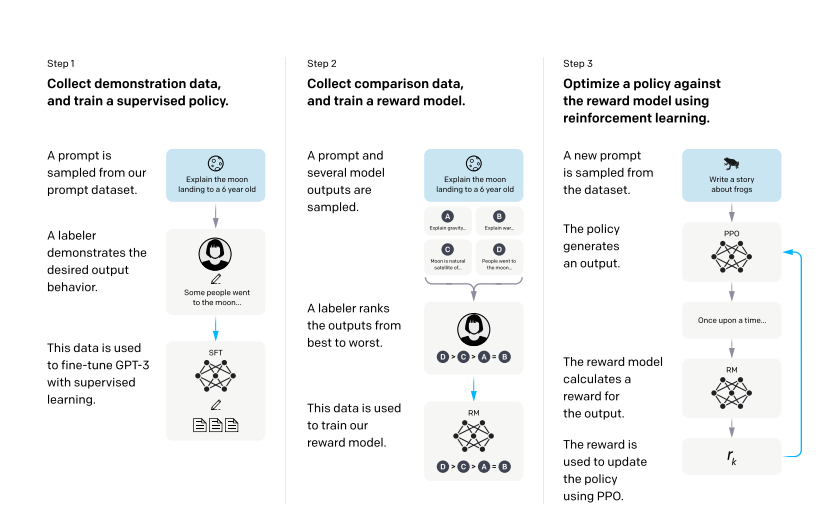

## Reinforcement Learning from Human Feedback (RLHF)

Reference: https://arxiv.org/pdf/2203.02155

Large language models should be 
1. Helpful 
2. Honest 
3. Harmless

Steps to fine tune the model to obtain human aligned LLM:
1. Get Prompt completion pair written by human to train the model using supervised learning.
2. Collect dataset of human labeled comparison between the output of the model on large set of API prompts. Feed the data to train a reward model (RM)
3. Re-inforcement learning algorithm (PPO is one such algorithm) is used on output of Reward model to update the weights of LLM. 
Multiple iterations of this step results into a Human aligned LLM.

### Reward hacking
LLM trained using Reward model might start to produce incorrect output only to improve output of the reward model.
This requires the need to ensure output generated by base model and human aligned model do not diverge.

**KL divergence** measures the difference between generated by base model and human generated model as input to the reinforcement learning
algorithms.
To understand how KL-Divergence works, imagine we have two probability distributions: the distribution of the original LLM, and a new proposed distribution of an RL-updated LLM. KL-Divergence measures the average amount of information gained when we use the original policy to encode samples from the new proposed policy.

## Constitutional AI

Reference: https://www.anthropic.com/news/claudes-constitution

Constituional AI is set of guidelines for the model to understand outputs which are toxic or discriminatory in nature. 

1. Model is trained to self critic and iterively revise the response of the model (Supervised learning stage).
2. Multiple responses generated by LLM are used to train Preference model based on the constituional preferences. (This replaces rewards model in RLHF). Preference model is then used to fine tune the original model.

**Example principles (Claude):**
* Please choose the response that most supports and encourages freedom, equality, and a sense of brotherhood. (1)

* Please choose the response that is least racist and sexist, and that is least discriminatory based on language, religion, political or other opinion, national or social origin, property, birth or other status. (2)
